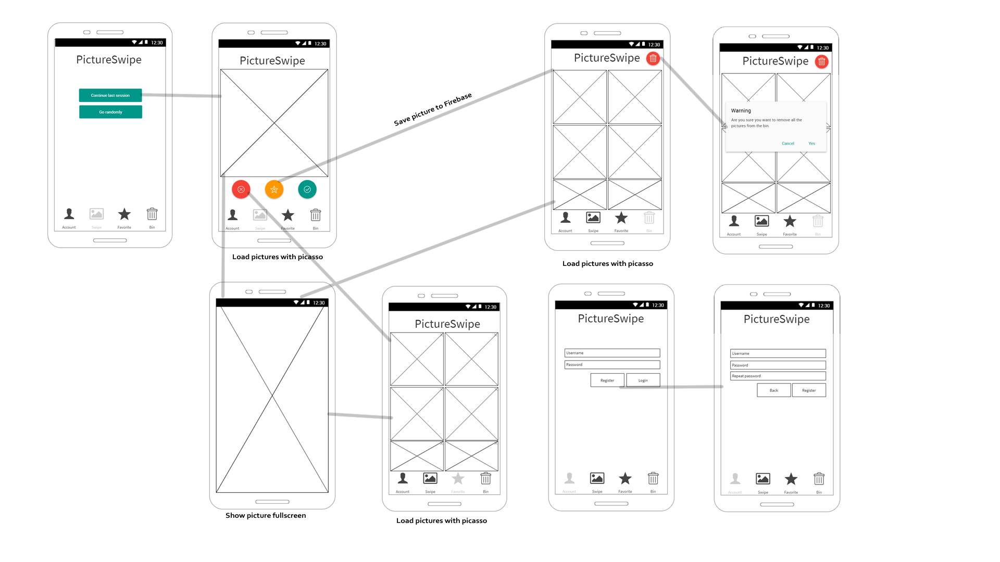

# Design

Each screen is it's own fragment, all inflated in the mainactivity. The progress is saved in the local sqlite database that contains
all names of the rated pictures. Favorites are saved online to Firebase, and available when logged in on a different device with the
same account. When there is no internet connection the pictures are saved to a specific table "Queued_Favorites" that 'll be uploaded
once the user is back online. The database structure is as follows:

The first table for the sqlite database. Name and date are saved for future reference. (Maybe want to implement that photo's are 
showing up again after a year or something like that).

*Progress*
_Filename_
_Date_

The second table for the sqlite database, it's used to keep track of the files it has to process to firebase when there is no internet
connection.

*Favorites*
_Filename_

The first table for the Firebase, it's used to save the favorite (important) pictures from the users into the cloud.

*UID*
_Pictures_

#### API's and Frameworks:
- Picasso
- Firebase

