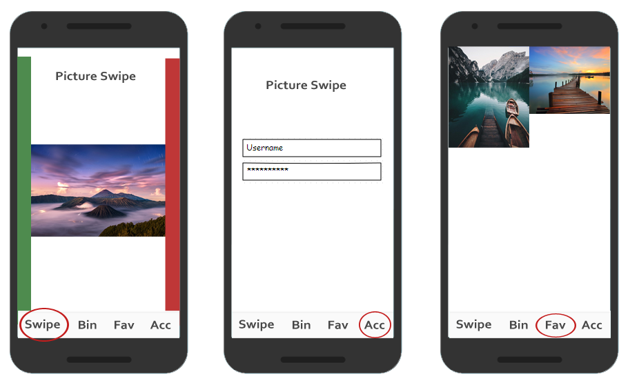

# PictureSwipe
Easily swipe trough your pictures

## Problem
A common problem is that we have thousands of photo's on our mobile phone. It's
relatively hard to select a chunk of pictures and remove them. Deleting multiple 
photos takes time and is inconvenient.

## Solution
A user friendly, easy and quick way to filter your pictures. 

The app gives you an easy way, by letting you swipe to left or right to remove or
keep the selected picture. It saves your progress, and at any time you can continue
your selection progress.

Important to note is that it doesn't immediately remove the pictures, but put them
into a "Bin"-list. This list can be reviewed anytime, so the user doesn't accidentially
removes his / her beloved pictures.

#### Main features
- _Swipe Action_: Swipe left or right to keep / remove pictures
- _Review removals_: There is a bin list that keeps the removed pictures until the user finally deletes them (with a button click).
- _Saved progress_: Your Progress is saved, so when you've seen the picture, you won't see it again. (Done by saving the name
/ hash from every picture that has been passed.
- _Favorites_: You can favorite the photos and find them in the favorites list. The favorites can be 
uploaded to firebase to be sure that you 'll always keep your favorites online, and across all your
devices.
- _Account_: To be able to save the favorites account creation and login is necessary 

#### Extra features
- _Selection criteria_: The photos can be selected by different criteria: Randomly, A certain year / month or just go trough
all of them.
- _Sorting_: Create a few albums and by swiping to certain corners that each represent an album, the picture
would be added accordingly.

#### Visual Sketch
Not very well done, needs a lot of revision.

#### External libraries
- Picasso; quickly loading pictures
- Firebase: Save favorite pictures online and make it available across devices.

#### Similar application
(Flic)[https://itunes.apple.com/us/app/flic-delete-manage-camera/id918263212?mt=8%20&ign-mpt=uo%3D4], available for ios but not for android. 
It uses the selection process like tinder does. They've kinda implemented the same structure using a bin and swiping like I defined
in the Main features. But it doesn't have things like favorites or selection criteria.

#### Hardest parts
- Swiping animation and smooth loading of the pictures is the hardest part, together with the extra feature of sorting your
own albums.

#### External sources
- 
 

