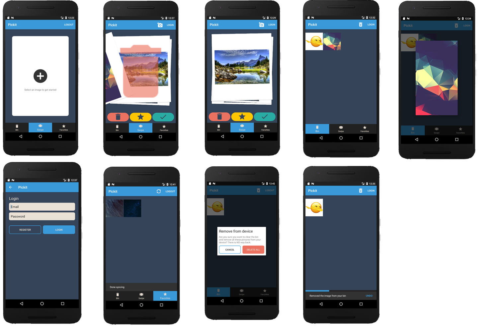

# Pickit

The app Pickit focuses on the people that have many pictures, and struggle to find a convenient way to manage them.
It allows users to select one of their albums and select if they wanna keep, delete or favorite the pictures, using
a intuitive swipe action. The option to sync favorites to the cloud, makes sure that the user 'll never lose their
precious pictures. They can boot up a new device and sync their favorites without any hassle.

#### Images



#### Solves a problem
A common problem is that we have thousands of photo's on our mobile phone. It's
relatively hard to select a chunk of pictures and remove them. Deleting multiple 
photos takes time and is inconvenient.

#### Solution
A user friendly, easy and quick way to filter your pictures. 

The app gives you an easy way, by letting you swipe to left or right to remove or
keep the selected picture. It saves your progress, and at any time you can continue
your selection progress.

Important to note is that it doesn't immediately remove the pictures, but put them
into a "Bin"-list. This list can be reviewed anytime, so the user doesn't accidentially
removes his / her beloved pictures.

#### Main features
- _Swipe Action_: Swipe left or right to keep / remove pictures
- _Review removals_: There is a bin list that keeps the removed pictures until the user finally deletes them (with a button click).
- _Saved progress_: Your Progress is saved, so when you've seen the picture, you won't see it again. (Done by saving the name
/ hash from every picture that has been passed).
- _Favorites_: You can favorite the photos and find them in the favorites list. The favorites can be 
uploaded to firebase to be sure that you 'll always keep your favorites online, and across all your
devices.
- _Account_: To be able to save the favorites account creation and login is necessary 

#### External sources
- [BetterCodeHub](https://bettercodehub.com/) 
- [SwipeStack](https://github.com/flschweiger/SwipeStack) (Licensed - Apache 2.0)
- [Firebase](https://firebase.google.com/) (Licensed - Creative Commons Attribution 3.0 License)
- [Picasso](http://square.github.io/picasso/) (Licensed - Apache 2.0)
- [Material Icons](https://material.io/icons/) (Licensed - Apache 2.0)
 
#### Code rating
[](https://bettercodehub.com/)

#### License
``` 
Copyright (C) 2018 SandervWickeren

Licensed under the Apache License, Version 2.0 (the "License");
you may not use this file except in compliance with the License.
You may obtain a copy of the License at

    http://www.apache.org/licenses/LICENSE-2.0

Unless required by applicable law or agreed to in writing, software
distributed under the License is distributed on an "AS IS" BASIS,
WITHOUT WARRANTIES OR CONDITIONS OF ANY KIND, either express or implied.
See the License for the specific language governing permissions and
limitations under the License.
 ```
